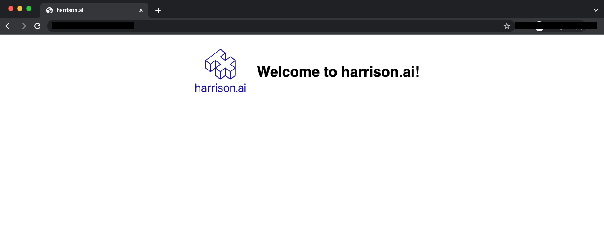

# HAI Platform DevOps Engineer Tech Task

## Overview

We would like to deploy a "hello world" application into our local development Kubernetes cluster for demonstration purposes.  We wish to use our favorite IaC tool, Terraform, to deploy this application.

You are required to  develop the Terraform configuration to deploy this application, which should serve up the html page below:



To hopefully assist you, we have created a docker compose stack that includes our Kubernetes distribution of choice, [k3s](https://docs.k3s.io/) and Terraform.  You may choose to use this stack if you wish, but are not obliged to, as there are many different ways of creating a local Kubernetes instance.


## Instructions

1. Please provide the Terraform code to deploy the example application, with the following requirements:
  -  The example application needs to run in the `harrison` namespace.
  - Use the open source `nginx` docker image.
  - 2 x replicas of the nginx web server should be running.
  - The nginx web server should use the included configuration file, `nginx.conf`.
  - The nginx web server should serve the included `index.html` file.
  - Assuming this application is deployed to a local dev/test Kubernetes instance (such as the one included in this repo), the application should be reachable from our local browser.
  - Note that creating an Kubernetes Ingress to achieve the previous requirement is not required, although would be considered a bonus.
2. Create a git repo containing your solution and push it to Github. We'll provide you with a few specific github `@user` handles to share it with the team you're working with.  Alternatively, any public repo we can access is also fine.
3. We will clone your repo and deploy your application ourselves in order to test it.
4. Please include a README, citing any third-party code, tutorials or documentation you have used.
5. Please note your deployment steps in the README.


## Instructions for using the docker compose stack in this repo (should you chose to use it)

### Requirements

- docker
- docker compose
- make

### Usage

- Clone this repo.
- From the root of this repo, run `make kube`.  This will bring up two containers; a k3s server and agent.
- A `kubeconfig.yaml` will be generated and placed at `./kubeconfig/kubeconfig.yaml`.
- We have also included a terraform docker compose container, should you chose to use it.  Access it via the `make tf-shell` command.  This will drop you into an interactive shell with the `terraform` command available.  See below for an example `provider.tf` to configure the Terraform Kubernetes provider.
- To bring down and reset the k3s environment, run `make down`.


### Example Terraform Provider configuration

Should you choose to use the included docker compose stack, you may use this example provider configuration snippet as a starting point.

```terraform
provider "kubernetes" {
  host                   = "https://server:6443"
  client_certificate     = base64decode(yamldecode(file("/app/kubeconfig/kubeconfig.yaml"))["users"][0]["user"]["client-certificate-data"])
  client_key             = base64decode(yamldecode(file("/app/kubeconfig/kubeconfig.yaml"))["users"][0]["user"]["client-key-data"])
  cluster_ca_certificate = base64decode(yamldecode(file("/app/kubeconfig/kubeconfig.yaml"))["clusters"][0]["cluster"]["certificate-authority-data"])
}
```
